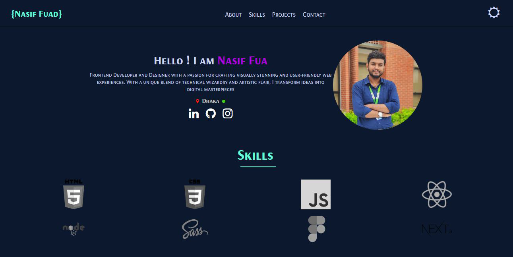

My Portfolio

Welcome to my portfolio! This project showcases my skills, projects, and experience as a developer. Below you’ll find an overview of what’s included, along with instructions for exploring the code and setting it up locally.

📜 Overview
This portfolio is designed to:

Highlight my skills and expertise
Feature my best projects and case studies
Provide a way to connect with me
🔧 Built With
HTML5 and CSS3 for structure and styling
JavaScript for interactive elements

✨ Features
Responsive Design – Optimized for all device sizes
Interactive Projects – Showcase of my favorite projects
Contact Form – This simple form for visitors to get in touch
📸 Screenshot

🚀 Getting Started
To run this project locally:

Clone the repo:
git clone https://github.com/yourusername/your-portfolio.git
Open index.html in your browser.
📫 Contact
Feel free to reach out if you have any questions or comments!

Email: nasifuad007@gmail.com
